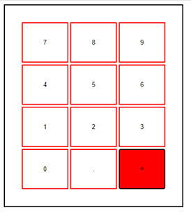
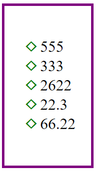

# Extra opdracht

Maak voor deze opdracht een `index.html`, een `index.js` en een `style.css` bestand aan.
Zorg ervoor dat je deze bestanden op de juiste manier aan elkaar linkt.

De uitdaging zit erin dat je in deze opdracht geen gebruik maakt van de `.innerHTML` of de `.innerText` functies.

1.	Maak in je HTML code, binnen de `body` tag, een `div` element aan met daarin 2 andere elementen:
    - `output-calculator`
    - `output-result`

2.	Definieer in het JavaScript bestand volgende array:

        let data = [[7,8,9],[4,5,6],[1,2,3],[0,”.”,”=”]];

3.	Het is de bedoeling dat je binnen het `output-calculator` element op een dynamische manier (met JavaScript) een tabel maakt van 4 rijen en 3 kolommen waarin elke cel een `button` voorstelt.
 
    Doe dit op basis van de eerder gedefinieerde data array. 

    Voorzie eveneens de nodige styling zodat je volgend resultaat bekomt (bij een hover wijzigt de kleur van het element, de "=" knop is hier het voorbeeld van):

    

 4.	De functionaliteit van dit cijferbord bestaat erin dat getallen worden samengesteld door herhaaldelijk op de buttons te klikken. 

    Bij elke klik wordt het cijfer bijgehouden in een variabele. Op het moment dat er op de "=" knop wordt geklikt, wordt er een nieuw lijstitem toegevoegd aan een ongeordende lijst.

    *Voorbeeld: wanneer je klikt op de button met waarde "1" en vervolgens op de button met waarde "3", gevolgd door een druk op de button met waarde "=" wordt in een ongeordende lijst een nieuw lijstitem met waarde "13" toegevoegd.* 

    Ga je vervolgens weer verder met klikken op de buttons, kan je nieuwe cijfers toevoegen en tonen in de lijst.

5.	De ongeordende lijst ziet er als volgt uit. Voorzie hier dus ook de nodige styling.

    